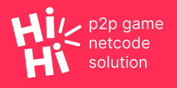
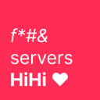
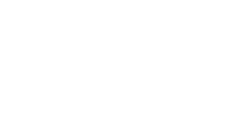
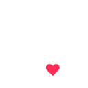

 `WIP`

An engine-agnostic P2P high-level multiplayer solution written in C#.

Made out of a passion for multiplayer games and spite for engine companies' anti-consumer/anti-indie practices. For indies with not a cent to spare on servers.

Still very much a work-in-progress currently. Many features required for the development of proper multiplayer games are currently missing and examples are being worked on.

[Licensed](LICENSE) under the ANTI-CAPITALIST SOFTWARE LICENSE (v 1.4). Need a different license? Contact me @ [stupidplusplus@gmail.com](mailto:stupidplusplus@gmail.com).


## Philosophy

### Why P2P?

Client-server is the standard in multiplayer games for its performance, ease of connection and security. Which is great, but running servers for your game is **EXPENSIVE**. Which increases risk and poses a challenge for small developers without the funds to tackle this challenge.

So if we can tackle issues like security, performance and connection, we can make multiplayer game development more accessible. Which seems a worthy cause. Because technical hurdles can be overcome with effort, but monetary hurdles may remain despite it.


### How?

#### Ease of development

When making multiplayer games with a client-server setup, you'll usually write code from 3 perspectives: The local player, the remote player and the server. Depending on your setup and/or desired optimizations, you might even have to write your client and server code separately. Using a decentralized P2P setup, you'll only write from 2 perspectives: The local player and the remote player.

The code for a networked enemy entity (in Godot) may look something like this:

```c#
using HiHi;

public partial class Enemy : GodotNetworkObject {
    public Sync<int> HealthSync;
    public RPC<int> DamageRPC;

    public void DoDamage(int damage) => DamageRPC.Invoke(damage, NetworkObject.OwnerID);

    protected override void OnRegister() {
        base.OnRegister();

        HealthSync = new Sync<int>(this, 100);
        DamageRPC = new RPC<int>(this);
        DamageRPC.Action = ReceiveDamage;
    }

    private void ReceiveDamage(int damage) {
        HealthSync.Value -= damage;

        if(HealthSync.Value <= 0) {
            NetworkObject.SyncDestroy();
        }
    }
}

```

You can then spawn this enemy by calling `INetworkObject.SyncSpawn(EnemySpawnData)`.


#### Performance

Some games may implement P2P by having one player be a Host that other players connect to. This setup however has none of the advantages of client-server when no dedicated servers exist. Furthermore, the host may have advantages over the joined players, in the form of reduced latency for example. HiHi uses fully decentralized P2P, meaning all players directly connect to each other, ensuring fairness amongst players.

HiHi uses ownership to ensure an object's data is only transmitted once (by the owner). This ensures that each player is doing less work than a dedicated server would and this setup is at least as efficient as a Host based setup.


#### Ease of connection

Computers behind firewalls or routers that use network address translation may be hard to reach. This problem can be circumvented by NAT punching or using services that ensure consistent P2P connections such as [Valve's Steam Datagram Relay](https://partner.steamgames.com/doc/features/multiplayer/steamdatagramrelay).

**WARNING:** These solutions are yet to be thoroughly tested, currently you may have to circumvent this problem yourself.


#### Security

Ownership ensures remote Peers can't mess with objects you own. Peers do, in contrast to how this works in a client-server setup, own their objects locally. Which means bad actors can manipulate these objects at will.

There is no substitute for physically removing control over objects through the use of a server. P2P remains vulnerable to bad actors, HiHi offers no current solution to this outside of ownership. Using HiHi in environments where trust is unlikely betrayed, such as co-op or party games where players play with/against friends. In scenarios where competition and/or matchmaking is involved, implementing an anti-cheat solution is recommended.


## Concepts

> **Peer**
>
> Provides an interface that represents the local peer.

> **Network**
>
> Describes the structure that contains all interconnected peers among the local peer.

> **HiHiTime**
>
> Provides synchronized time information.

> **NetworkObject**
>
> The base class for networked entities that exist on all interconnected peers. Can implement SyncObjects like Sync and RPC.
>
> NetworkObjects can be either owned by a single peer or be shared by all peers in the network.

> **Abandonment**
>
> When the peer that owns a NetworkObject disconnects from the network, it is abandoned. This invokes its abandonment policy, deciding which peer, if any, will become its new owner.

> **Sync\<T>**
>
> Used to synchronize variables between peers. Bound to a NetworkObject.

> **RPC**
>
> Used to invoke actions on remote peers.

> **NetworkTransform**
>
> Used to synchronize a transform's position, rotation and scale between peers.

> **NetworkPhysicsBody**
>
> Used to synchronize a physics body's position, rotation, scale, velocity and angular velocity between peers.

> **Question\<T>**
>
> Used to request variables from remote peers.

> **PeerFinder**
>
> The base class used for implementations that allow the local peer to discover remote peers.

> **Signaler**
>
> The base class used for implementations that introduce peers to each other.


## Implementation

HiHi currently includes engine bindings for [Godot](https://godotengine.org/). Meaning HiHi will work out of the box in that engine. If you're using a different engine you'll have to create your own bindings. [Unity](https://unity.com/) bindings will be provided at some point.

Required bindings for implementation are currently:

- **IHelper** - *Handles the serialization and deserialization of SpawnData.*
- **INetworkObject** - *Implements*
- **ISpawnData** - *Serializable object containing information required to spawn objects on remote peers*
- **MiscBindings** *(Optional)* - *Provides implicit conversion between HiHi's Vectors, Quaterions, etc and the engine's version of these objects.*


## Roadmap

- [x] Connections
- [x] Local discovery
- [x] Serialization
- [x] Messaging
- [x] Networked objects
- [x] Ownership
- [x] Synchronized variables
- [x] RPC's
- [x] Time synchronization
- [x] Synchronized transforms
- [x] Synchronized physics bodies
- [x] Synchronized spawning & destruction
- [x] Spawn history synchronization for new connections
- [x] Abandonment
- [x] Questions
- [x] Message allocation optimization
- [x] Prettify NetworkObject implementation
- [x] PeerMessage sender header optimization
- [x] Signaling
- [x] NAT punching *To be more extensively tested.*
- [ ] Democracy
- [ ] Unity Bindings
- [ ] Example project
- [ ] Getting started tutorial


## Thanks

Includes code from [Netstack](https://github.com/nxrighthere/NetStack/) licensed under MIT.

[Anti-capitalist software license](https://anticapitalist.software/) maintained by [Ramsey Nasser](https://nas.sr/) & [Everest Pipkin](https://everest-pipkin.com/).


## Images

|  |  |  |
| --------------------------------------------------- | ------------------------------------------------------- | --------------------------------------------------------- |
|  |  |  |
|  |  |  |

